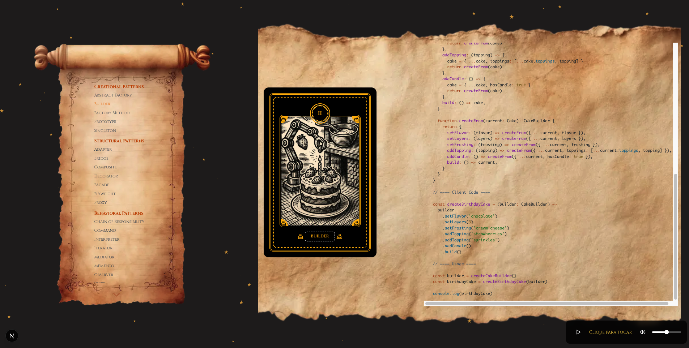

# Pattern-cards



Pattern-cards is an interactive web application that presents classic software design patterns as beautifully illustrated tarot cards. Each card features a unique visual, a brief description, and a code example for the corresponding design pattern, making learning design patterns engaging and visually appealing.

## Features

- **Tarot Card Visualization:** Each design pattern is represented as a tarot card with custom artwork and thematic borders.
- **Pattern Categories:** Patterns are organized into Creational, Structural, and Behavioral categories for easy navigation.
- **Interactive UI:** Click on a pattern to view its card, read a summary, and see a highlighted code example.
- **Audio Experience:** Enjoy an ambient audio track while exploring the cards.
- **Visual Effects:** Includes animated backgrounds and parchment-style overlays for an immersive experience.

## Getting Started

To run the project locally:

```bash
npm install
npm run dev
```

Then open [http://localhost:3000](http://localhost:3000) in your browser.

## Project Structure
- `app/` - Main application code and components
- `patterns/` - Code examples for each design pattern
- `public/` - Static assets, including card images and audio
- `renderPattern/` - Logic for rendering code samples

## About
Pattern-cards is designed for developers, students, and educators who want to explore and learn software design patterns in a fun and memorable way.
